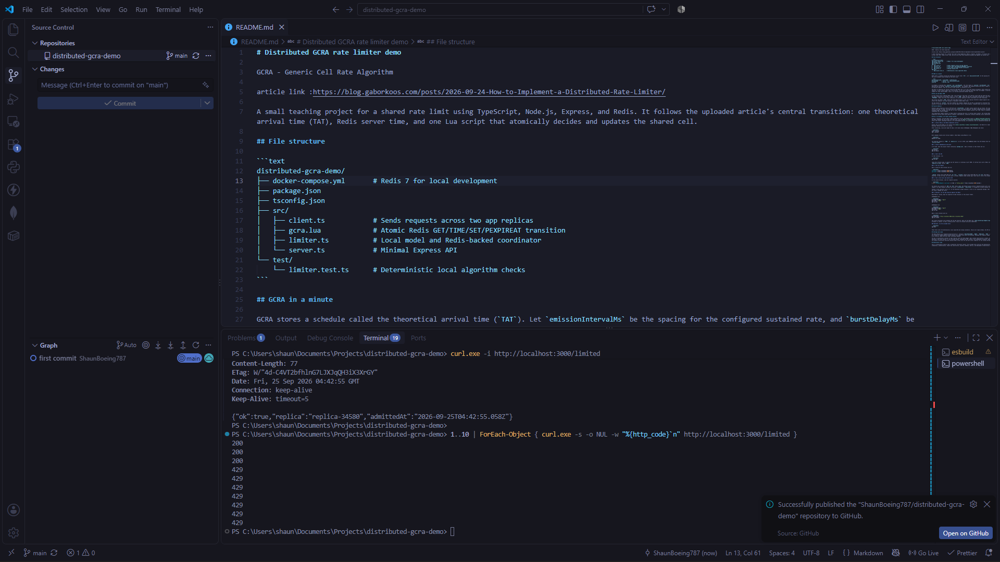

# Distributed GCRA rate limiter demo

GCRA - Generic Cell Rate Algorithm

article link :https://blog.gaborkoos.com/posts/2026-09-24-How-to-Implement-a-Distributed-Rate-Limiter/

A small teaching project for a shared rate limit using TypeScript, Node.js, Express, and Redis. It follows the uploaded article's central transition: one theoretical arrival time (TAT), Redis server time, and one Lua script that atomically decides and updates the shared cell.



## File structure

```text
distributed-gcra-demo/
├── docker-compose.yml       # Redis 7 for local development
├── package.json
├── tsconfig.json
├── src/
│   ├── client.ts            # Sends requests across two app replicas
│   ├── gcra.lua             # Atomic Redis GET/TIME/SET/PEXPIREAT transition
│   ├── limiter.ts           # Local model and Redis-backed coordinator
│   └── server.ts            # Minimal Express API
└── test/
    └── limiter.test.ts      # Deterministic local algorithm checks
```

## GCRA in a minute

GCRA stores a schedule called the theoretical arrival time (`TAT`). Let `emissionIntervalMs` be the spacing for the configured sustained rate, and `burstDelayMs` be the extra schedule slack allowed by the burst size:

```text
emissionIntervalMs = round(1000 / ratePerSecond)
burstDelayMs       = (burst - 1) * emissionIntervalMs
anchored           = max(TAT, now)
```

An attempt is rejected when `anchored - now > burstDelayMs`. The retry delay is `anchored - burstDelayMs - now`; rejection does not change TAT. Otherwise it is admitted and TAT becomes `anchored + emissionIntervalMs`. For example, 100 requests/second with burst 3 means a 10 ms interval and 20 ms burst delay: three calls can be admitted together, then the fourth at that instant is rejected for 10 ms.

The burst is shared by all callers using the same Redis key. It is not a per-replica allowance. Every replica must use the same rate and burst values and the same key identity. A local limiter keeps TAT in one process, so two local instances each have their own budget. A distributed limiter stores one TAT in Redis, so replicas compete for that shared budget. There is no fairness guarantee between replicas.

## Why Lua and Redis TIME

If each replica did a separate Redis read, local decision, and write, two replicas could read the same TAT and both spend the same allowance. `src/gcra.lua` performs the whole transition as one Redis script: it calls `TIME`, reads the one key, calculates the decision, and on admission writes the next TAT and sets its expiry with `PEXPIREAT`. Redis runs the script atomically, so another admission cannot interleave with that transition.

The script uses Redis `TIME` rather than each Node process's clock. All replicas therefore compare against one clock source. Clock corrections on the Redis host still affect the schedule; this demo assumes a reasonably stable Redis clock.

The key expires at `nextTat`. Once the schedule has elapsed, keeping the old TAT is equivalent to starting from current time, so expiry needs no cleanup worker. An expired or missing key begins from TAT zero and admits from a fresh allowance. Premature data loss while an active key exists can reset that budget early.

## Failure behavior

Ordinary limit exhaustion returns HTTP 429 with `retryAfterMs`. If Redis cannot confirm the Lua result, the limiter throws `CoordinatorUnavailableError` and the API returns HTTP 503. It never runs downstream work without confirmed admission. The Redis command may have succeeded even if its reply was lost; in that case the allowance might be charged, but the call is still refused and the schedule recovers over time. There is intentionally no local fallback because that would create independent per-replica budgets.

This educational sample connects to Redis before listening and exits if startup cannot connect. The runtime Redis client does not keep reconnecting indefinitely. A production service would need explicit timeouts, observability, connection lifecycle handling, and an operational policy for Redis outages.

## Run it on Windows in VS Code (without Docker)

Docker is optional. The app needs a Redis-compatible service. One Windows option is [Memurai Developer Edition](https://www.memurai.com/get-memurai), which supports the Redis commands and Lua scripts this demo uses. See the [Memurai installation guide](https://docs.memurai.com/). Install it as a Windows service if the installer offers that choice. Developer Edition is for development/testing, not production, and its documented maximum uptime is 10 days.

### 1. Install Node.js and Redis-compatible service

Install the current Node.js LTS release from [nodejs.org](https://nodejs.org/en/download/). Use Node 20 or newer (the client uses built-in `fetch`). Install Memurai Developer Edition and start its service.

After installing, close and reopen VS Code. In VS Code choose **Terminal → New Terminal** and check:

```powershell
node --version
npm --version
```

Both commands should print version numbers. Check Redis using Memurai's CLI:

```powershell
memurai-cli ping
```

The expected response is `PONG`. If `memurai-cli` is not on PATH, open **Memurai CLI** from the Windows Start menu and run `ping` there. The app defaults to Redis at `127.0.0.1:6379`.

### 2. Install dependencies and build

In VS Code, open the project folder containing `package.json`. Open a terminal in that folder and run:

```powershell
npm install
npm run build
```

### 3. Start the API

In that terminal, run:

```powershell
npm run dev
```

Leave this terminal open. It should say the replica is listening on port 3000. If startup fails with a Redis connection error, check that Memurai is running and `memurai-cli ping` returns `PONG`.

### 4. Test one request

Open a second VS Code terminal and run:

```powershell
curl.exe -i http://localhost:3000/health
curl.exe -i http://localhost:3000/limited
```

`/health` should return HTTP 200 with `ok: true`. `/limited` should return HTTP 200 with `ok: true` when Redis confirms admission. An HTTP 200 means this request was admitted; it does not mean the rate limit is broken. Requests made seconds apart have time to refill the allowance.

### 5. Test a fast burst and observe 429

In the second terminal, send ten requests quickly:

```powershell
1..10 | ForEach-Object { curl.exe -s -o NUL -w "%{http_code}`n" http://localhost:3000/limited }
```

You should see a mixture of `200` and `429` status codes. The default policy allows 5 requests/second with a burst of 3. `429` means the limiter rejected that request; its JSON response includes the precise `retryAfterMs`. `Retry-After` is rounded up to whole seconds for HTTP clients.

Typing a stray character such as `V` at the PowerShell prompt produces a “term is not recognized” message. That is just PowerShell treating it as a command; it does not stop or damage the server.

### 6. Optional: run two app replicas against one Redis

Keep Memurai running. Open two separate VS Code terminals in the project folder.

**Terminal 1:**

```powershell
$env:REPLICA_NAME = "app-a"
$env:PORT = "3000"
npm run dev
```

**Terminal 2:**

```powershell
$env:REPLICA_NAME = "app-b"
$env:PORT = "3001"
npm run dev
```

Open a third terminal and run:

```powershell
$env:REPLICAS = "http://localhost:3000,http://localhost:3001"
npm run client
```

The client alternates calls between the two app replicas. Both use one Redis key (`demo:{shared-api-budget}:request`) and the same default settings, so the rate/burst allowance is shared. To stop a running server, focus its terminal and press **Ctrl+C**.

### Optional: run the included tests

```powershell
npm test
```

These tests cover the deterministic local algorithm and timing validation. They do not require Redis; the API and two-replica demo do.

## Settings and scope

The demo defaults to 5 requests/second and burst 3. Configure `RATE_PER_SECOND`, `BURST`, `REDIS_URL`, `PORT`, and `REPLICA_NAME` through environment variables. Rates are limited to 1–1000 requests/second because this sample uses whole milliseconds. Rounding can slightly change effective throughput; for example 30/sec rounds to a 33 ms interval (about 30.3/sec under continuous demand).

The key is deliberately constant to make replicas share one demo budget. Real systems should derive a stable, bounded-cardinality identity such as tenant plus operation, and avoid secrets or raw untrusted values. Changing the key creates a new independent allowance. Changing the rate or burst while replicas share the key can produce inconsistent decisions because Redis stores only TAT and each caller supplies its own timing settings.

## Educational scope

This is intentionally smaller than a production resilience library. The included tests exercise the deterministic local transition and timing validation. Redis integration, authentication, tenant key construction, graceful shutdown, metrics, and deployment orchestration are left out so the core shared algorithm stays visible.
